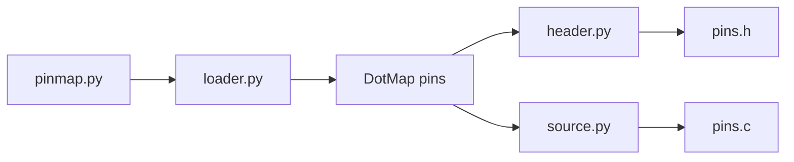

# Code Generation with Cog

The build system uses [cog](https://nedbatchelder.com/code/cog/) to auto-generate C code from Python definitions.

## Why Code Generation?

- **DRY principle** — Define pins, constants, or tables once in Python
- **Compile-time safety** — Generated code matches configuration exactly
- **Dev/Release variants** — Different pins/settings for different build targets

## Cogfiles Definition

Projects list files to process in `cogfiles.txt`:

```
src/pins.h -r
src/pins.c -r
src/os/judi/hash.h -r
```

The `-r` flag means "replace generated code in place."

## Cog Directive Syntax

```c
/* [[[cog
    from codegen import fmt
    import pins
    
    cog.outl(fmt(pins.pin_declarations()))
]]] */

// Generated code appears here between markers

// [[[end]]]
```

The `cog` module is injected by the build system and provides `cog.outl()` for output.

## Pin Generation Flow



## pinmap.py Structure

Projects define their pin mappings:

```python
from pins import Pin

class Pin:
    input = ['input']
    output = ['output']
    uart_tx = ['output', 'pps']
    uart_rx = ['input', 'pps']
    analog_in = ['input', 'analog']
    button = ['input', 'gpio', 'pullup']

# Common pins for all builds
common = {
    'A2': ('BRIGHTNESS_PIN', Pin.analog_in),
    'B4': ('COLOR_PIN', Pin.analog_in),
    'B5': ('DEBUG_RX_PIN', Pin.uart_rx),
    'B7': ('DEBUG_TX_PIN', Pin.uart_tx),
}

# Development-only pins
development = {}

# Release-only pins  
release = {}
```

## Generated Output

### Header File (`pins.h`)

```c
// GPIO read functions
extern bool read_BUTTON_A_PIN(void);
extern bool read_BUTTON_B_PIN(void);

// Button count
#define NUMBER_OF_BUTTONS 2

// PPS Pin macros
#define PPS_DEBUG_RX_PIN PPS_INPUT(B, 5)
#define PPS_DEBUG_TX_PIN PPS_OUTPUT(B, 7)

// ADC Channel macros
#define ADC_BRIGHTNESS_PIN 2
#define ADC_FWD_PIN 22
```

### Source File (`pins.c`)

```c
bool read_BUTTON_A_PIN(void) { return PORTBbits.RB0; }
bool read_BUTTON_B_PIN(void) { return PORTBbits.RB1; }

void pins_init(void) {
    TRISBbits.TRISB0 = 1;    // BUTTON_A_PIN - input
    ANSELBbits.ANSELB0 = 0;  // BUTTON_A_PIN - digital
    
    TRISAbits.TRISA2 = 1;    // BRIGHTNESS_PIN - input
    ANSELAbits.ANSELA2 = 1;  // BRIGHTNESS_PIN - analog
    // ...
}
```

## Dev/Release Pin Variants

Pins can differ between development and production hardware:

```python
development = {
    'B5': ('DEBUG_RX_PIN', Pin.uart_rx),  # Dev board uses B5
}

release = {
    'C0': ('DEBUG_RX_PIN', Pin.uart_rx),   # Production uses C0
}
```

The loader generates conditional code:

```c
#ifdef DEVELOPMENT
    TRISBbits.TRISB5 = 1;    
#endif
#ifdef RELEASE
    TRISCbits.TRISC0 = 1;    
#endif
```

## Automatic Build Integration

Code generation runs during `make compile`:

```makefile
$(PROJECT_HEX): $(PROJECT_FILES)
    $(VENV_PYTHON) -m cogapp --verbosity=1 -I$(TOOLCHAIN_DIR)/cogscripts ...
    $(VENV_PYTHON) $(TOOLCHAIN_DIR)/scripts/compile.py
```

## Cogscript Modules

| Module | Purpose |
|--------|---------|
| `pins/loader.py` | Load pin definitions from `pinmap.py` or CSV |
| `pins/source.py` | Generate `pins_init()` and function definitions |
| `pins/header.py` | Generate header declarations |
| `pins/functions.py` | Pin function signature helpers |
| `codegen/*.py` | General code generation utilities |

## Custom Code Generation

Projects can add their own cog scripts. The build system adds `toolchain/cogscripts` to the Python path, so modules there are importable.