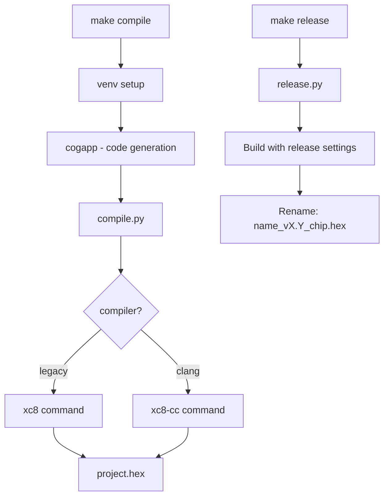

# Toolchain Module Summary

Custom Python-based build system wrapping Microchip XC8 compiler. Uses Make for orchestration and Python for build logic, configuration, and code generation.

## Architecture



## Make Targets

| Target | Purpose |
|--------|---------|
| `make compile` | Build development hex |
| `make upload` | Flash to device via programmer |
| `make release` | Build release hex (optimized, no debug) |
| `make program` | Program release hex to chip |
| `make clean` | Remove build artifacts |
| `make lint` | Run cppcheck static analysis |
| `make config` | Run configuration wizard |

## Project Configuration (`project.yaml`)

Projects define settings in `project.yaml` at the project root:

```yaml
name: MyProject
hw_version: "1.0"
sw_version: "2.3"

build_settings:
  development:
    programmer: Pickit4
    processor: 18F16Q41
    defines:
      - DEVELOPMENT
      - SHELL_ENABLED
      - LOGGING_ENABLED
  
  release:
    programmer: Pickit4
    processor: 18F16Q41
    defines:
      - RELEASE
    skip_rules:
      - src/shellcommands/*
      - src/os/shell/*
```

### Development vs Release Profiles

| Profile | Purpose | Defines |
|---------|---------|---------|
| `development` | Debug builds with full features | `DEVELOPMENT`, `SHELL_ENABLED`, etc. |
| `release` | Production builds, minimal features | `RELEASE` only |

### How Defines Work

The `defines` list becomes `-D` compiler flags:

```python
# In xc8.py
defines = [
    f'__XC8_{env.standard.upper()}__',
    '_XC_H_',
    f'__PRODUCT_NAME__={project.name}',
    f'__PRODUCT_VERSION__={project.git_hash}',
    f'__PROCESSOR__={env.processor}',
    *env.defines,  # ← from project.yaml
]
for symbol in defines:
    flag(f'-D{symbol}')
```

This means `defines: [SHELL_ENABLED, LOGGING_ENABLED]` produces:
```
-DSHELL_ENABLED -DLOGGING_ENABLED
```

Use in C code:
```c
#ifdef SHELL_ENABLED
    shell_init();
#endif
```

### Skip Rules for Release Builds

Files matching `skip_rules` patterns are excluded from release builds:

```yaml
skip_rules:
  - src/shellcommands/*
  - src/os/shell/*
  - src/os/json/*
```

## Compiler Support

Two compiler backends:

| Compiler | Class | YAML Flag |
|----------|-------|-----------|
| `xc8` | Legacy (XC8 v2.x) | `compiler: legacy` |
| `xc8-cc` | Clang-based (XC8 v3.x) | `compiler: clang` |

Default is legacy compiler.

## Code Generation

Codegen runs via [cog](https://nedbatchelder.com/code/cog/) before compilation.

**Key principle**: Project-specific codegen lives in the project, NOT in the toolchain.

```
project-root/
├── project.yaml          # Build configuration
├── cogfiles.txt          # List of files to process
├── pinmap.py            # Pin definitions (project-specific)
└── src/
    ├── pins.h           # Cog block generates GPIO declarations
    ├── pins.c           # Cog block generates init code
    └── backlight.c      # Cog block generates lookup tables
```

The toolchain provides helper modules in `cogscripts/codegen/`:
- `Enum` - Generate C enums from Python lists
- `Struct` - Generate C structs
- `Function` - Generate function declarations/definitions
- `pins` - Generate pin GPIO code from `pinmap.py`

See [codegen.md](codegen.md) for writing cog blocks.

## Virtual Environment

Uses `uv` for Python dependency management. Scripts run in the toolchain's virtual environment.

## Key Scripts

| Script | Purpose |
|--------|---------|
| `compile.py` | Orchestrates XC8 compilation |
| `project.py` | Loads/validates project.yaml |
| `skip.py` | Filters source files for release |
| `release.py` | Build release, rename hex |
| `upload.py` | Flash to device |
| `program.py` | Program release hex |
| `xc8.py` | Legacy compiler wrapper |
| `xc8_cc.py` | Clang compiler wrapper |
| `configure.py` | Interactive project.yaml wizard |

## Static Analysis

Run `cppcheck` for static analysis:

```bash
make lint
```

The linter checks:
- C89 standard compliance
- All `#ifdef` configurations
- AVR8 platform (closest to PIC18)
- Unused functions, memory leaks, null pointers

Inline suppressions are supported:

```c
// cppcheck-suppress memoryLeak
buffer = malloc(256);  // Intentionally never freed
```

See [reports.md](reports.md) for post-build memory analysis.

## Further Documentation