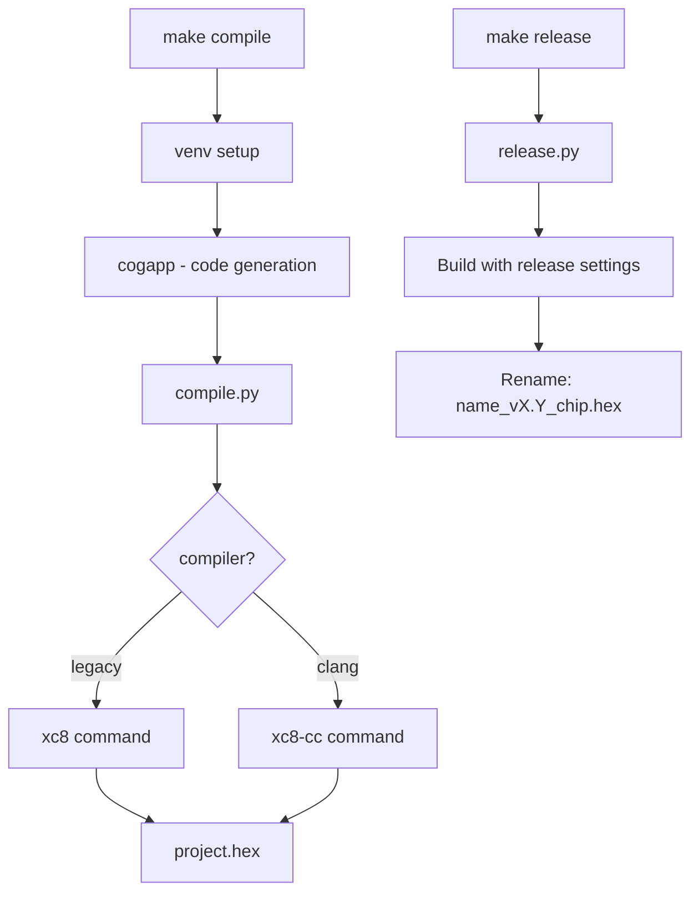

# Toolchain Module Summary

Custom Python-based build system wrapping Microchip XC8 compiler. Uses Make for orchestration and Python for build logic, configuration, and code generation.

## Architecture



## Make Targets

| Target | Purpose |
|--------|---------|
| `make compile` | Build development hex |
| `make upload` | Flash to device via programmer |
| `make release` | Build release hex (optimized, no debug) |
| `make program` | Program release hex to chip |
| `make clean` | Remove build artifacts |
| `make lint` | Run cppcheck static analysis |
| `make config` | Run configuration wizard |

## Project Configuration

Projects define settings in `project.yaml`:

```yaml
name: MyProject
hw_version: "1.0"
sw_version: "2.3"

build_settings:
  development:
    programmer: Pickit4-linux
    processor: 18F16Q41
    defines:
      - DEVELOPMENT
      - SHELL_ENABLED
      - LOGGING_ENABLED
    
  release:
    programmer: Pickit4
    processor: 18F16Q41
    defines:
      - RELEASE
    skip_rules:
      - src/shellcommands/*
      - src/os/shell/*
```

## Compiler Support

Two compiler backends:

| Compiler | Class | Flag |
|----------|-------|------|
| `xc8` | Legacy (XC8 v2.x) | `compiler: legacy` |
| `xc8-cc` | Clang-based (XC8 v3.x) | `compiler: clang` |

Default is legacy compiler.

## Code Generation

Uses [cog](https://nedbatchelder.com/code/cog/) for code generation:
- Pin definitions from `pinmap.py`
- PPS functions from hardware descriptions
- Dev/Release pin variants

See [codegen.md](codegen.md) for details.

## Virtual Environment

Uses `uv` for Python dependency management. Scripts run in the toolchain's virtual environment.

## Key Scripts

| Script | Purpose |
|--------|---------|
| `compile.py` | Orchestrates XC8 compilation |
| `project.py` | Loads/validates project.yaml |
| `skip.py` | Filters source files for release |
| `release.py` | Build release, rename hex |
| `upload.py` | Flash to device |
| `program.py` | Program release hex |
| `xc8.py` | Legacy compiler wrapper |
| `xc8_cc.py` | Clang compiler wrapper |